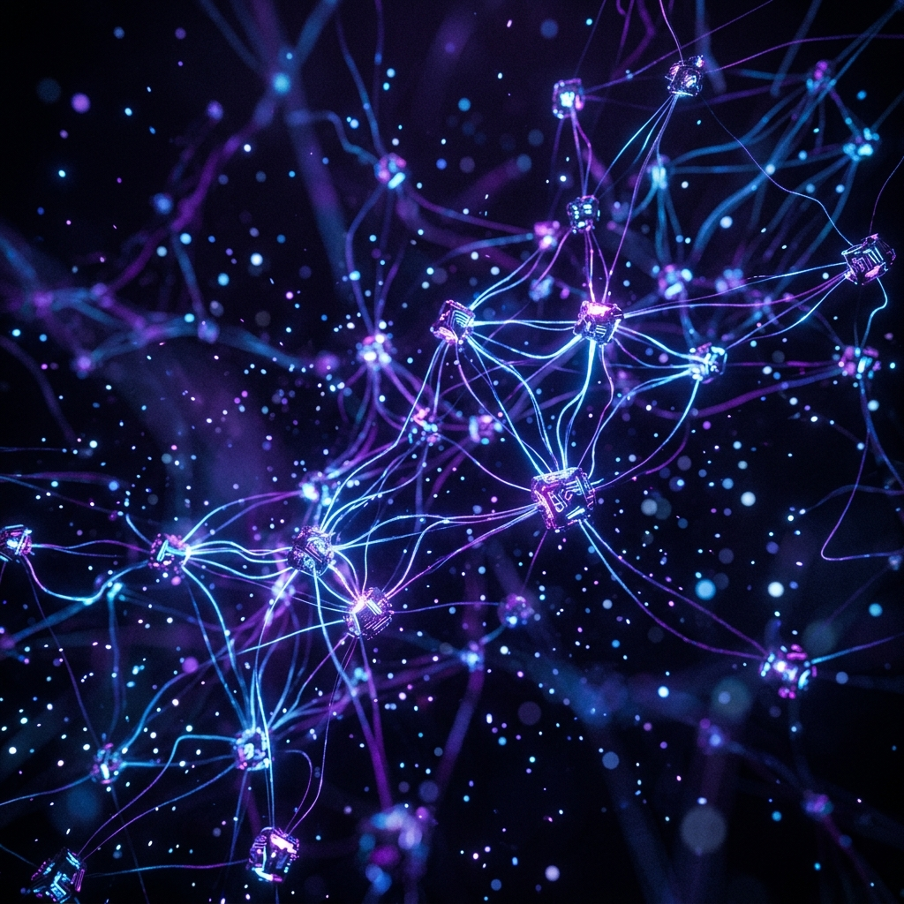
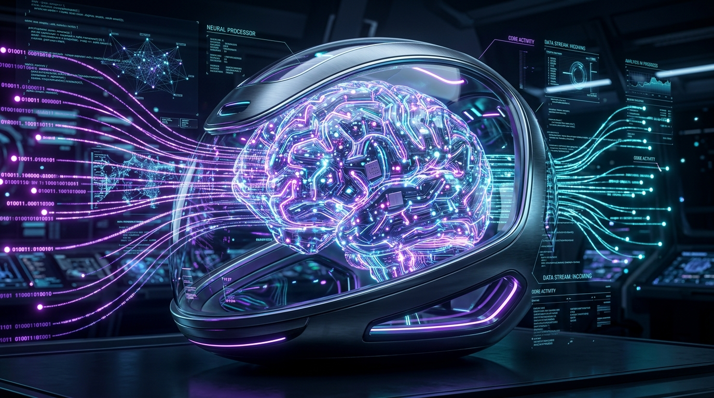
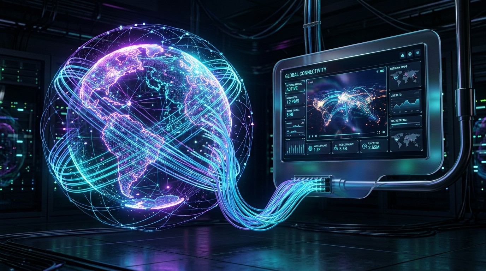
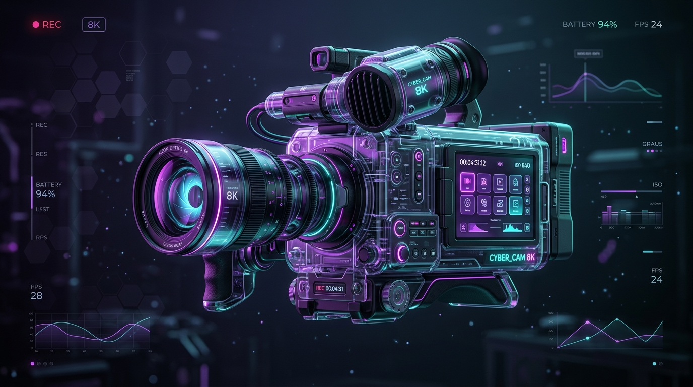
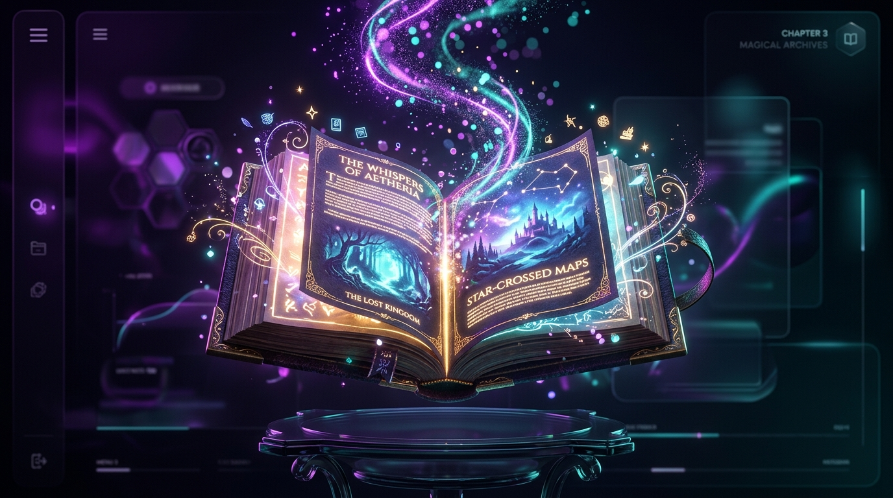
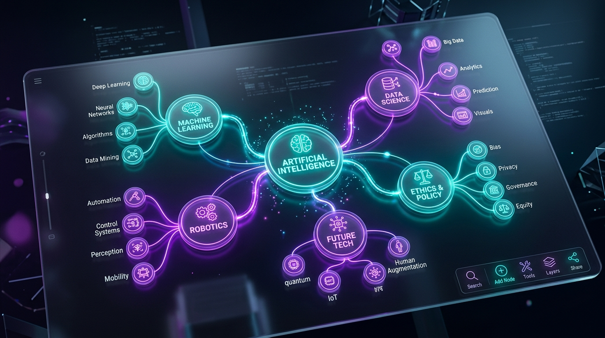
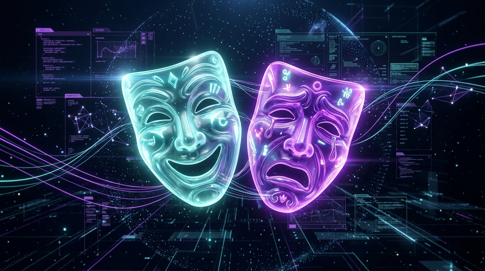

<div align="center">
  
  
  <br />
  <h1>🎬 Clipped AI - The Open-Source Video Creation Super-Repo</h1>
  <p><strong>Fully autonomous, AI-driven video studio and render pipeline built on Next.js 16, FFmpeg, and Supabase.</strong></p>
  
  [](https://opensource.org/licenses/MIT)
  [](https://nextjs.org/)
  [](https://supabase.com/)
  [](https://ffmpeg.org/)
</div>

<hr />

## 🌟 What is Clipped AI?

Clipped AI is a **massive "super-repository"** containing a complete, end-to-end video generation pipeline. It replaces expensive SaaS tools by providing a self-hosted engine that can take a simple text prompt, a blog URL, or a raw script, and autonomously output a fully-edited, highly-retaining short-form video (TikTok, Shorts, Reels) within minutes.

By leveraging **OmniRoute** (our proprietary LLM routing gateway), **FFmpeg**, and **Remotion**, the system acts as a digital editor, voice actor, and director all in one.

---

## ⚡ Core Features

### 🧠 OmniRoute AI Orchestration
Our local `omniroute-server` gateway handles intelligent routing between OpenAI, Anthropic, Gemini, and local models. It features automatic rate-limit detection and cascading fallbacks, ensuring your generation pipelines never fail.

### 🎙️ Resilient TTS Cascade
Clipped integrates a multi-tiered Text-to-Speech (TTS) fallback system. It attempts high-fidelity voice cloning via **ElevenLabs**, falls back to **OpenAI TTS**, and if all quotas are exhausted, flawlessly defaults to keyless **Edge TTS** so your rendering queue never blocks.

### 🎬 Heavy-Duty FFmpeg Render Worker
The background worker orchestrates complex compositions. It supports dynamic Ken-Burns zoom and pan camera moves, "Hormozi-style" word-by-word Karaoke subtitles with custom glows and outlines, automated B-roll fetching, and background music ducking natively in FFmpeg.

---

## 🎞️ 12+ Autonomous Workflows

Clipped supports highly specialized workflows tailored to specific content niches.

<div align="center">
  <table>
    <tr>
      <td align="center">
        <br />
        <b>Auto-Pilot Engine</b><br/><i>Generate complete videos from a single prompt</i>
      </td>
      <td align="center">
        <br />
        <b>URL to Video</b><br/><i>Scrape blogs & news articles into viral shorts</i>
      </td>
      <td align="center">
        <br />
        <b>AI Videos</b><br/><i>Cinematic AI-generated storytelling</i>
      </td>
    </tr>
    <tr>
      <td align="center">
        <br />
        <b>Reddit Stories</b><br/><i>Split-screen gameplay and TTS narration</i>
      </td>
      <td align="center">
        <br />
        <b>Whiteboard Animation</b><br/><i>Educational sketch-style explainers</i>
      </td>
      <td align="center">
        <br />
        <b>Micro-Drama</b><br/><i>Multi-character AI soap operas</i>
      </td>
    </tr>
  </table>
</div>

---

## 🏗️ System Architecture & Media Pipeline

Clipped relies on an intelligent cascading media pipeline for generation:
- **Text & LLM Engine**: Powered exclusively by the OmniRoute local gateway on port `:20128`.
- **Stock Media**: Falls back gracefully across Openverse (keyless), Pexels, Pixabay, and Pollinations. Openverse attribution and license metadata is automatically preserved.
- **AI Media Generation**: Video and high-fidelity image generation utilizes [fal.ai](https://fal.ai/). 

**Note on Media URLs**: Generated media URLs from services like fal.ai and Pollinations may expire. The built-in worker downloads these URLs to durable storage prior to the final video rendering pipeline.

---

## 🚀 Getting Started

### 1. Install Dependencies
Clipped uses `pnpm` (v11+) to handle its massive monorepo workspace.
```bash
pnpm install
```

### 2. Configure Environment
Copy `.env.example` to `.env.local` and fill in your Supabase credentials, OmniRoute keys, and media API keys.

### 3. Run the Studio Stack
You need three terminals to run the complete ecosystem locally:
```bash
# 1. Start the Next.js 16 Web Studio
pnpm dev

# 2. Start the local OmniRoute Gateway
cd omniroute-server && npm run start

# 3. Start the Background FFmpeg Render Worker
npm run worker
```

Open [http://localhost:3000](http://localhost:3000) with your browser to enter the studio.

---

## 📖 Internal Documentation & Development Journal

For developers, contributors, and agents working on the codebase, refer to the internal architectural docs:

- **Master System Architecture**: [`docs/PROJECT_GIST.md`](docs/PROJECT_GIST.md)
- **Master Daily Changelog**: [`daily_documentation.md`](daily_documentation.md)
- **Chronological Devlogs**: [`docs/devlogs/`](docs/devlogs/INDEX.md)
- **Persistent Memory Protocol**: [`.agents/rules/daily-documentation.md`](.agents/rules/daily-documentation.md)
