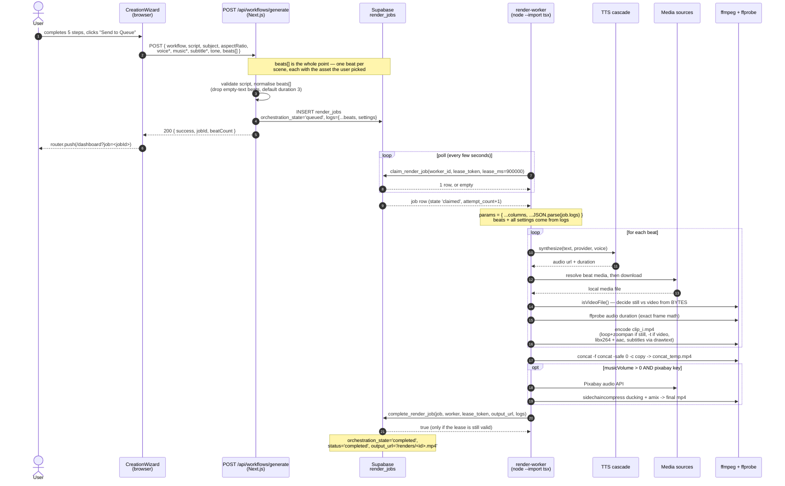
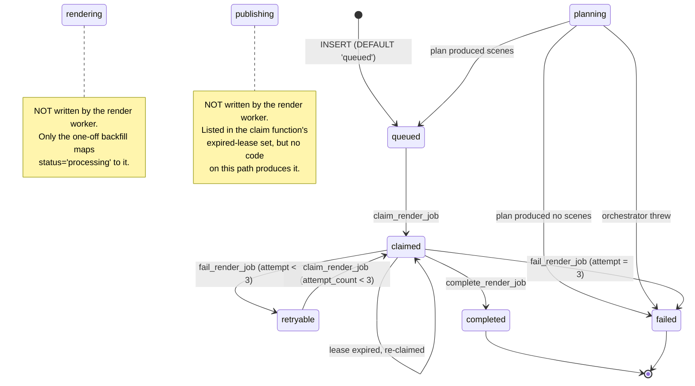

# Render Pipeline — End-to-End: Wizard to MP4

> **Repository:** [`ajayspi/clipped-ai-studio`](https://github.com/ajayspi/clipped-ai-studio)
> **Scope:** the single request/response path that carries a video from the 5-step creation wizard to a finished `.mp4` on disk.
> **Runtime verified against:** the live dev server + Supabase + a running `render-worker` on 2026-09-28.
> **Diagram sources:** the Mermaid blocks in this file are canonical. PlantUML mirrors live in [`diagrams/`](./diagrams/) for export; see [§9](#9-diagram-sources-and-drift).

This document describes **only** the render path. It is not an architecture overview, an API
reference, or a deployment guide.

**Read this first if you touch the queue.** Two bugs on this path failed *silently*: the queue
route answered `200 {"success": true}` on a job that could never render, and the worker reported
`completed` on a 0.17-second, 2-frame "video". A green HTTP status and a green job status are both
unreliable signals here. The authoritative test of "will this render?" is `claim_render_job`, not
the API response — see [§4](#4-the-claim-contract).

---

## Table of contents

1. [The happy path](#1-the-happy-path)
2. [Part 1 — The queue boundary](#2-part-1--the-queue-boundary)
3. [Part 2 — Claiming a job](#3-part-2--claiming-a-job)
4. [The claim contract](#4-the-claim-contract)
5. [The render job state machine](#5-the-render-job-state-machine)
6. [Part 3 — The per-beat render loop](#6-part-3--the-per-beat-render-loop)
7. [Part 4 — Concat, music, and completion](#7-part-4--concat-music-and-completion)
8. [Failure and retry semantics](#8-failure-and-retry-semantics)
9. [Diagram sources and drift](#9-diagram-sources-and-drift)
10. [Known divergences and traps](#10-known-divergences-and-traps)
11. [An observed run, end to end](#11-an-observed-run-end-to-end)

---

## 1. The happy path

Four processes are involved. The browser and the web process never touch the render loop directly —
they meet at one database row.



PlantUML source: [`diagrams/render-pipeline-sequence.puml`](./diagrams/render-pipeline-sequence.puml)

---

## 2. Part 1 — The queue boundary

`POST /api/workflows/generate` is the **only** queueing endpoint any UI page calls, and it serves all
four wizard workflows (`stories`, `ai-videos`, `footage`, `images`).

### What the wizard sends

`components/wizard/CreationWizard.tsx:116-176`. The payload is built in `sendToQueue()`. The
important part is `beats`, where the user's per-beat asset selection is deliberately **ordered
first** so the worker can read `urls[0]` without knowing anything about selection state:

```ts
beats: w.beats.map((beat) => {
  const candidates = beat.candidates ?? [];
  const selected = candidates.find((c) => c.id === beat.selectedId) ?? candidates[0];
  const rest = candidates.filter((c) => c.id !== selected?.id);
  const ordered = selected ? [selected, ...rest] : rest;
  return {
    id: beat.id,
    text: beat.text,
    duration: beat.duration,
    urls: ordered.map((c) => c.url).filter(Boolean),
  };
})
```

### What the route does with it

`app/api/workflows/generate/route.ts`. Four steps matter.

**1. Normalise the beats** (`:52-67`). Drops non-objects, drops beats whose text is blank (a
blank-text beat renders as the literal placeholder `Clipped Video Beat`), defaults `duration` to `3`,
and mirrors `urls[0]` onto `clipUrl` so both spellings the worker accepts agree.

**2. Choose the state string** (`:125-129`). This is the critical line:

```ts
const hasBeats = submittedBeats.length > 0
const initialState: 'planning' | 'queued' = hasBeats ? 'queued' : 'planning'
```

`orchestration_state` is a `TEXT` column that `claim_render_job` matches against a literal
allow-list. It is a **state machine, not a settings bag**. When the wizard supplied beats there is
nothing left to plan, so the job goes straight to `'queued'` and the worker may claim it
immediately. With no beats, `'planning'` keeps the worker away until a plan exists.

**3. Write settings to `logs`, not to the state column** (`:107-147`). The worker merges
`job.logs` into its params, so `beats`, `aspectRatio`, `subject`, `tone`, the voice settings and
`subtitleSettings` all go into `logs`.

> **Why the split matters.** The worker still contains
> `try { orchState = JSON.parse(job.orchestration_state) } catch { orchState = {} }`
> (`scripts/render-worker.ts:388`). With a plain state string in that column, `JSON.parse('queued')`
> throws and `orchState` becomes `{}` — so `orchState.voice` is *always* unavailable. Anything the
> worker needs must be in `logs`. This is why voice settings are duplicated into both spellings
> (`:88-98`).

**4. Return, or plan in the background** (`:162-176`). With beats, the route returns
`200 { success, jobId, beatCount }` immediately. Without beats it re-plans from `script` via
`videoOrchestrator` / `imageOrchestrator` in a fire-and-forget `setTimeout`, then promotes to
`'queued'` **only if the plan actually produced scenes**; otherwise the job is marked `'failed'`
rather than left claimable and beatless.

### The bug this replaced

The route previously never destructured `beats`, `aspectRatio` or `subject` at all, and wrote
`orchestration_state` as a **JavaScript object**. Postgres stored that object as a JSON string,
which is in neither `('queued','retryable')` nor the expired-lease set — so every wizard job was
permanently unclaimable, and the route still answered `200 {"success": true}`.

Measured across all four workflows before the fix:

| workflow | http | status | plain state? | beats kept | claimable |
|---|---|---|---|---|---|
| stories | 200 | `generating_plan` | no | 0 | **no** |
| ai-videos | 200 | `generating_plan` | no | 0 | **no** |
| footage | 200 | `generating_plan` | no | 0 | **no** |
| images | 200 | `generating_plan` | no | 0 | **no** |

Guarded by `T22-QUEUE-01` and `T22-QUEUE-02` in `tests/e2e/standalone-runner.js`.

Verified live after the fix. The route was driven with three beats (one deliberately blank) and
then with none, and `claim_render_job` was called directly against the resulting rows — the row was
backdated so it sorted first, since the function claims the **oldest** claimable job:

| case | state written | plain string? | beats in `logs` | returned by `claim_render_job`? |
|---|---|---|---|---|
| 3 beats submitted, 1 blank | `"queued"` | yes | 2 (blank dropped) | **yes** |
| no beats submitted | `"planning"` | yes | 0 | **no** |

The second row is the point of the whole boundary: a `200` on a job the worker will never touch is
precisely the failure this section exists to prevent.

---

## 3. Part 2 — Claiming a job

`scripts/render-worker.ts` runs as a standalone poll loop (there is no queue broker; the database
*is* the queue).

- **Worker identity** (`:65`): `process.env.RENDER_WORKER_ID || \`render-worker-${process.pid}\``
- **Lease token** (`:321`): `crypto.randomUUID()` per claimed job
- **Lease duration** (`:73`): `max(60_000, RENDER_LEASE_MS || 900_000)` — **15 minutes**
- **Heartbeat** (`:354`): renews every `max(15_000, LEASE_MS / 3)` = **300 s**, filtered on
  `id` + `worker_id` + `lease_token`

The 15-minute default is deliberate: a single job is TTS-per-beat plus a media fetch per beat, and
every paid provider is attempted before the keyless fallback, so a 7-beat video was measured at
5–8 minutes — longer than the previous hardcoded 5 minutes.

---

## 4. The claim contract

Sole definition: `supabase/migrations/20260905_render_job_leases.sql:23-78`. No later migration
redefines it.

```sql
CREATE OR RETURNS TABLE (id UUID, orchestration_state TEXT, lease_token TEXT)
FUNCTION public.claim_render_job(
  p_worker_id  TEXT,
  p_lease_token TEXT,
  p_lease_ms   INTEGER DEFAULT 300000
)
```

A row is claimable when **either** branch holds, **and** attempts remain:

| branch | condition | line |
|---|---|---|
| fresh work | `orchestration_state IN ('queued', 'retryable')` | `:46` |
| stale lease | `orchestration_state IN ('claimed','rendering','publishing')` **AND** `lease_expires_at IS NOT NULL` **AND** `lease_expires_at < now()` | `:48-50` |
| attempts | `attempt_count < max_attempts` (default `3`) | `:53` |

Ordering is `created_at ASC` with `FOR UPDATE SKIP LOCKED LIMIT 1` — oldest first, and concurrent
workers never contend on the same row. No match returns an **empty set** (not `NULL`, not an
error), which the client wrapper reads as `?? null` (`lib/jobs/render-job.ts:20-35`).

On a successful claim the function writes:

```
orchestration_state = 'claimed'
status              = 'processing'
worker_id           = p_worker_id
lease_token         = p_lease_token
lease_expires_at    = now() + p_lease_ms
attempt_count       = attempt_count + 1
started_at          = COALESCE(started_at, now())
last_error          = NULL
```

> **The column is `attempt_count`, not `current_attempt`.** `current_attempt` is a PL/pgSQL local
> variable inside `fail_render_job` (`:121`) and **not a column**. Querying `current_attempt` fails
> with `column render_jobs.current_attempt does not exist` — which is an easy way to convince
> yourself a job does not exist when it does.

### The dangerous default

```sql
orchestration_state TEXT NOT NULL DEFAULT 'queued'   -- :2
```

**Leaving this column unset makes a job claimable.** A planning-only or terminal job that forgets to
set it explicitly is picked up by the render worker, which builds an empty `concat.txt`, and ffmpeg
rejects it — burning all three attempts. Any route that inserts a job which is *not* ready to render
must set the column explicitly. Guarded by Tier 20 (`T20-CLAIM-01/02/03`).

---

## 5. The render job state machine



PlantUML source: [`diagrams/render-job-state.puml`](./diagrams/render-job-state.puml)

`rendering` and `publishing` are listed in the claim function's stale-lease branch but are not
written by `scripts/render-worker.ts`; they survive from the one-off backfill at
`20260905_render_job_leases.sql:11-18` (`status='processing' → 'rendering'`). A worker that crashes
mid-render leaves the row in `'claimed'`, which *is* in the reclaimable set — so the reclaim path
works without them. They are documented here rather than silently drawn as if they were live.

---

## 6. Part 3 — The per-beat render loop

`scripts/render-worker.ts:461-628`. Params come from the row's own columns merged with `logs`
(`:381`): `params = { ...params, ...JSON.parse(job.logs) }`.

### 6.1 TTS cascade

Provider selection (`:469-470`):

```
requestedProvider = params.voiceProvider || orchState.voiceProvider
                    || (elevenKey ? 'elevenlabs'
                       : googleKey ? 'google_tts'
                       : azureKey  ? 'azure_speech'
                       : 'keyless')
```

`orchState` is always `{}` in practice (see [§2](#2-part-1--the-queue-boundary)), so the effective
input is `params.*`, i.e. `logs`. The engine then builds its own cascade
(`lib/engine/tts.ts:780-787`):

| order | provider | key source | notes |
|---|---|---|---|
| 1 | `elevenlabs` | `resolveVoiceProviderApiKey('elevenlabs')` → request → `settings` table → `ELEVENLABS_API_KEY` | `eleven_multilingual_v2`, `mp3_44100_128` |
| 2 | `omniroute` | request → `getOmniRouteConfig().apiKey` | OpenAI-compatible, `model: tts-1`, `POST {baseUrl}/v1/audio/speech` |
| 3 | `keyless` | none | sub-cascade below |
| 4 | `keyless` (retry) | none | post-loop safety net, `:890-897` |
| 5 | `mock` | none | synthetic sine WAV, `:900-907` |

Each provider is wrapped in one `try/catch` (`:875-887`); a throw is logged, recorded in
`providerAttempts`, and the loop advances. **There is no per-provider timeout in that loop**, so a
hanging provider blocks the whole cascade.

The keyless sub-cascade (`lib/engine/tts.ts:1307-1422`):

1. **Edge TTS** — `node-edge-tts`, 5 s timeout plus a 5 s `Promise.race` guard
2. **Google Translate TTS REST** — `translate.google.com/translate_tts`, 5 s abort, chunked at ≤180 chars
3. **Synthetic WAV** — 24 kHz mono sine, `providerUsed: 'mock'`, `isDryRun: true`

A TTS failure does **not** fail the beat: the worker logs it and continues with `audioUrl = ''`
(`:496-499`). The clip then gets a silent `anullsrc` track (`:632`).

**Key resolution order** everywhere (`lib/engine/tts.ts:656-721`): explicit `request.apiKey` →
`settings` table row (skipping `is_active === false`) → `process.env` → none.

### 6.2 Media cascade

Resolution order (`:502`), verbatim:

```
b?.selectedVideo?.url || b?.imageUrl || b?.videoUrl || b.clipUrl
   || b.urls?.[0] || b.candidates?.[0]?.url || ''
```

If that is empty, two fallbacks (`:505-526`):

1. **OmniRoute images** — `POST http://localhost:20128/v1/images/generations`.
   ⚠️ **The request body is empty and no auth header is sent.** `fullPrompt` is computed at `:505`
   and never transmitted. In practice this always throws `Invalid OmniRoute response`.
2. **Pollinations** — on any throw, the URL is assigned for later download:
   ```
   https://image.pollinations.ai/prompt/<encodeURIComponent(fullPrompt)>?width=1024&height=1024&nologo=true
   ```

Because step 1 is effectively dead, **Pollinations is the de-facto production image source** for
beats that arrive without a user-picked asset.

### 6.3 Still vs video — decided from the bytes

After downloading to a neutral `media_<i>.dl` (`:537-541`), the file is **probed, not guessed**
(`:544-561`):

```ts
isVideo = await isVideoFile(downloadPath)   // ffprobe, lib/engine/ffprobe.ts
// then renamed to media_<i>.mp4 or media_<i>.jpg to match
```

`isVideoFile` (`lib/engine/ffprobe.ts:270-331`) runs
`ffprobe -count_frames -read_intervals %+2 -select_streams v:0` and decides in this order:

1. moving-image container (`mov,mp4`, `matroska,webm`, `avi`, `flv`, …) → video
2. still-image container (`image2`, `jpeg_pipe`, `png_pipe`, `webp_pipe`, …) → still
3. frame count from the first 2 s: `> 1` → video, `<= 1` → still
4. codec name against a still-image codec set
5. **final fallback: `return false` (still)** — the safe direction, because a still always renders
   via the zoompan/loop path

> **This probe replaced a URL substring test, and the old test was a production bug.**
> `const isVideo = mediaUrl.includes('video')` matched the *URL*, and the Pollinations fallback
> embeds the URL-encoded beat text in its path. So any script that merely **mentioned the word
> "video"** — trivially common in a video studio — was classified as video, skipped `zoompan`, and
> took `-t <duration>` truncation instead of `-loop`. Each beat encoded to roughly one frame.
>
> Measured on a 2-beat job: `completed` with a **0.17 s / 2-frame** output, versus 5.03 s / 124
> frames for the identical job without the word "video". After the fix: 5.66 s and 49 frames per
> 2 s. Guarded by `T22-MEDIA-01`/`02` and `test/render-media-type.test.ts`.

### 6.4 Duration and clip encode

```
finalDuration = exactDuration > 0 ? exactDuration : (duration || b.duration || 3)
```

`exactDuration` is the ffprobe-measured TTS audio length (`:573`). It is what makes frame-accurate
subtitles possible.

Filter chain (`:587-603`):

| component | applied when | expression |
|---|---|---|
| scale + crop | always | `scale=W:H:force_original_aspect_ratio=increase,crop=W:H` |
| `zoompan` | **stills only** | `lib/engine/ffprobe.ts:362-375`, `d=frames`, `fps=25`, alternating in/out per beat index |
| `drawtext` subtitles | `burnSubtitles !== false` | `:133-304`; karaoke mode emits one `drawtext` per word gated by `enable='between(t,start,end)'` |

Encode (`:605-651`) → `clip_<i>.mp4`:

- still → `.loop(finalDuration)`; video → `inputOptions(['-t <dur>'])`
- audio: the real TTS file, **or** `anullsrc=r=44100:cl=stereo` + `-t <dur>` when TTS failed
- `-c:v libx264 -map 0:v:0 -map 1:a:0 -c:a aac -b:a 192k -pix_fmt yuv420p -shortest`, plus
  `-tune stillimage` for stills

---

## 7. Part 4 — Concat, music, and completion

### Concat (`:662-675`)

`concat.txt` of `file '<clip>'` lines, then
`ffmpeg -f concat -safe 0 -c copy` → `concat_temp.mp4`. Stream copy, so no re-encode.

### Background music (`:683-725`)

Gated on `musicVolume > 0 && pixabayKey`. Both must be truthy or music is skipped and
`concat_temp.mp4` is copied straight to the output (`:728`).

```
GET https://pixabay.com/api/audio/?key=<key>&q=<musicQuery>
```

`musicQuery` is `params.musicSource`, or `'cinematic ambient'` when the source is
`'Random Background Music'` (`:686-688`). A random track is chosen from the first
`min(3, hits)` results and `track.preview` is downloaded (`:691-695`). A fetch or parse failure is
logged and the render continues without music.

Ducking filter graph (`:708-713`), verbatim:

```
[1:a]volume=<musicVolume/100>[bgm]
[0:a]asplit[main1][main2]
[bgm][main1]sidechaincompress=threshold=0.08:ratio=4:attack=5:release=50[bgm_ducked]
[main2][bgm_ducked]amix=inputs=2:duration=first:dropout_transition=2[aout]
```

with `-c:v copy -c:a aac -b:a 192k -shortest`.

> Note the asymmetry: `lib/engine/audio-mixer.ts:205-216` contains a **second, different** filter
> graph (threshold `0.125`, attack `50`, release `300`, plus fades). It is not imported by the
> render worker. Only the graph above is on the render path.

### Completion (`:738-744`)

```ts
completeRenderJob(renderJobRpc, {
  jobId: claim.id, workerId, leaseToken,
  outputUrl: '/renders/<jobId>.mp4',
  logs: { ...params, finalVideoUrl: publicUrl, duration: totalDurationSeconds },
})
```

`complete_render_job` (`:80-107`) verifies **four** conditions before writing — `id`,
`worker_id`, `lease_token`, and `lease_expires_at > now()`. It writes `orchestration_state='completed'`,
`status='completed'`, `output_url`, `logs`, `completed_at`, and clears `lease_expires_at`. It does
**not** clear `worker_id`/`lease_token`.

`completeRenderJob` **throws** when the RPC returns `false`
(`lib/jobs/render-job.ts:73-79`) — a `false` means the lease expired or ownership was lost, and
silently leaving the job `claimed` would be worse.

The output file is `public/renders/<jobId>.mp4`, served at `/renders/<jobId>.mp4`.

---

## 8. Failure and retry semantics

`fail_render_job` (`:109-153`) re-checks the same four conditions under `FOR UPDATE`, then:

```sql
orchestration_state = CASE WHEN attempt_count < max_attempts THEN 'retryable' ELSE 'failed' END
status              = CASE WHEN attempt_count < max_attempts THEN 'pending'    ELSE 'failed' END
last_error          = p_error_message
error_message       = p_error_message
lease_expires_at    = NULL
```

`attempt_count` was already incremented at claim time, so with `max_attempts = 3` a job is claimed
and retried exactly three times, then lands in `'failed'`.

The worker's `catch` (`:747-755`) calls `failRenderJob`, and the `finally` block clears the renewal
timer and removes the job temp directory.

> **Asymmetry worth knowing:** `failRenderJob` does **not** inspect the RPC's boolean return
> (`lib/jobs/render-job.ts:86-95`), unlike `completeRenderJob`. A job whose lease expired mid-render
> is therefore neither failed nor retried by that call — it sits in `'claimed'` until the lease
> expiry makes it reclaimable.

---

## 9. Diagram sources and drift

Mermaid in this file is the **canonical** version — it is what renders on GitHub, and it is reviewed
in the same diff as the prose. The PlantUML files are exports for people who need real UML tooling:

| diagram | Mermaid | PlantUML |
|---|---|---|
| end-to-end sequence | [§1](#1-the-happy-path) | [`diagrams/render-pipeline-sequence.puml`](./diagrams/render-pipeline-sequence.puml) |
| render job state machine | [§5](#5-the-render-job-state-machine) | [`diagrams/render-job-state.puml`](./diagrams/render-job-state.puml) |

The two can drift. Each `.puml` file names the section it mirrors in its header, and `T23-DIAGRAM-01`
in `tests/e2e/standalone-runner.js` fails if a `.puml` file loses that reference or is not linked
from this document. **If you change a diagram, change both.**

PlantUML is not rendered by GitHub. To export:

```bash
plantuml docs/diagrams/*.puml     # writes .png next to each source
# or: java -jar plantuml.jar -tsvg docs/diagrams/render-job-state.puml
```

---

## 10. Known divergences and traps

Findings verified on 2026-09-28. Each is a place where the code and the documentation of it
disagree, or where a name promises something the code does not do.

### 10.1 The Subtitles step previews controls the render ignores

`components/wizard/SubtitlesStep.tsx` exposes four controls that never reach the encoded video. They
work in the live preview because the preview computes them locally, but the queue route does not
carry them and the worker has no consumer for them:

| control | in wizard payload | read by route | read by render worker | effect on the mp4 |
|---|---|---|---|---|
| `subtitleBoxOpacity` | yes | **no** | no | ignored; worker hardcodes `@0.7` in `normalizeBoxColor` (`render-worker.ts:115-131`) |
| `subtitleBoxRadius` | yes | **no** | no | **none** |
| `subtitleLetterSpacing` | yes | **no** | no | **none** |
| `subtitleMaxWidth` | yes | **no** | no | **none** |
| `voiceoverMode` | yes | no | no | **none** — no consumer anywhere in the repo |

`subtitleBoxOpacity` is the subtle one: the preview composes
`rgba(r, g, b, subtitleBoxOpacity / 100)` (`SubtitlesStep.tsx:151-163`) and only that composed value
is preview-local. The render path receives the raw hex and applies a hardcoded alpha of `0.7`. The
default happens to be `70` (`wizard-store.ts:308`), so the default *looks* correct and every
non-default value is silently wrong.

### 10.2 Remotion is not in the render path

`docs/PROJECT_GIST.md:6` lists Remotion as the video engine. It is not. `scripts/render-worker.ts`
imports only `fluent-ffmpeg`, `lib/jobs/render-job`, `lib/engine/ffprobe`, `lib/logger`,
`@clipped/schema`, and a dynamic `lib/engine/tts`. It never imports `@remotion/*`.

The only Remotion trace on this path is a **vestigial log line** at `:455`:

```ts
console.log(`   -> Remotion composition binding: ${compId}`)
```

`compId` (`'MainRender-9x16'` and friends, `:446-453`) is never passed anywhere. `remotion/`
contains exactly one file, `Composition.tsx`, which no application code imports — only tests that
`readFileSync` it and assert on its text. `remotion` and `@remotion/player` are installed, and there
is no `remotion` npm script. **All rendering on this path is plain ffmpeg.**

### 10.3 Declared providers with no handler

| declaration | site | reality |
|---|---|---|
| `openverse` in `PLATFORMS` | `lib/engine/video-sourcer.ts:5` | `search()` returns `[]` (`:102`) |
| `unsplash` in `PLATFORMS` | `lib/engine/image-sourcer.ts:4` | `search()` returns `[]` (`:95`) |
| `coqui` in the `TTSProvider` union | `lib/engine/tts.ts:35` | `synthesizeWithCoqui` exists (`:1234-1298`) but is never pushed into `providersToTry` — unreachable |
| "AI Horde" step 5 | `lib/media/image-sources.ts:5` (doc comment) | no AI Horde code exists in the file |

`searchImages` in `lib/media/image-sources.ts` is the one place with a genuine **sequential**
cascade: Openverse (keyless) → Pexels → Pixabay → Pollinations. The `VideoSourcer`/`ImageSourcer`
`search()` methods instead fan out with `Promise.all`, so "cascade" is not the right word for them.

### 10.4 Two different Openverse hosts

`lib/media/image-sources.ts:22` uses `api.openverse.engineering`; `lib/api-router.ts:292` uses
`api.openverse.org`. One of them is wrong.

### 10.5 The worker is not run by bun

`AGENTS.md` states the workers run under `interpreter: 'bun'`. `ecosystem.config.js:31-32, 43-44`
is the authority and uses `interpreter: 'node'` with `interpreter_args: '--import tsx'`. The
`worker` / `worker:publish` npm scripts also use `tsx` directly.

### 10.6 Render cost

Each `libx264` encode at 1080×1920 will use every available core by default; there is no `-threads`
cap and no `-preset` limit. A 2-beat probe job takes roughly 30 s of wall clock and saturates the
machine, so do not leave the render worker running while running the test suite — the contention
shows up as spurious vitest failures.

### 10.7 Unused render params

`enableDucking` defaults to `true` (`:378`) and `bgmVolume` defaults to `0` (`:377`), but the BGM
gate reads **`params.musicVolume`** (`:679`) and `enableDucking` is never read at all.

---

## 11. An observed run, end to end

A real two-beat job through the wizard's own Send to Queue, captured from the running worker. Note
that every paid provider fails and the keyless fallback carries the job — and that the job
nonetheless completes with a valid file.

```
Found pending job: 6be1bcec-66c4-4924-a3b8-9b75f82be968
   -> Remotion composition binding: MainRender-9x16          <- vestigial, see 10.2
🎬 Generating TTS for 2 beats...
   - Beat 1: "PROBE ai-videos first beat...."
[TTS] Synthesizing with ElevenLabs (key source: request)...
[WARN] tts: TTS provider attempt failed
[TTS] Provider elevenlabs attempt failed: ElevenLabs HTTP 402: Payment Required. Continuing fallback cascade.
[WARN] tts: TTS provider attempt failed
[TTS] Provider omniroute attempt failed: OpenAI TTS HTTP 429: Too Many Requests. Continuing fallback cascade.
[TTS] Requesting keyless audio from Edge TTS: voice=en-US-AriaNeural, lang=en-US
     -> Calling local OmniRoute for image...
[WARN] render-worker: OmniRoute image failed, falling back to Pollinations
     -> OmniRoute local failed, falling back to Pollinations: Invalid OmniRoute response
     -> Downloading media (jpg)...
     -> Exact audio duration: 2.736s
   - Beat 2: "PROBE ai-videos second beat...."
     ... (same cascade) ...
     -> Exact audio duration: 2.832s
🎬 Concatenating 2 clips into final video...
     -> Fetching background music...
Failed to download BGM: SyntaxError: Unexpected token 'E', "[ERROR 403]"... is not valid JSON
[INFO] render-worker: Render complete
🎬 Render complete: ...\public\renders\6be1bcec-66c4-4924-a3b8-9b75f82be968.mp4
```

The resulting file, verified with `ffprobe`:

```
codec_name=h264   width=1080  height=1920
duration=5.656015
```

The BGM `403` is caught, `bgmDownloaded` stays `false`, and the worker falls through to
`copyFileSync` — so a music failure degrades quality but never fails the job.

All four wizard workflows were exercised this way after the fix:

| workflow | result | duration | frames in first 2 s |
|---|---|---|---|
| stories | `completed` | 5.117 s | 49 |
| ai-videos | `completed` | 5.656 s | 49 |
| footage | `completed` | 5.030 s | 49 |
| images | `completed` | 5.030 s | 49 |

49 frames in 2 s is a continuous 25 fps track — the `zoompan` still-image path working as intended.
Before the media-type fix, `ai-videos` reported `completed` at **0.17 s / 2 frames**.
